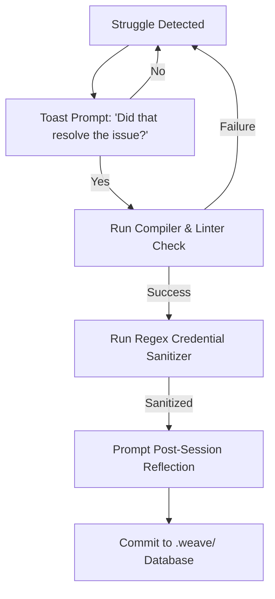

# SkillWeave

**SkillWeave** is an agentic telemetry and collaborative learning companion. It captures the logs, workspace diffs, and developer reflections from team members steering AI agents, indexes them in a local-first peer database, and surfaces them as Socratic guideposts when another teammate gets stuck on similar coding, design, or architectural problems.

Unlike standard autocomplete or code search, SkillWeave does **not** copy-paste or spoon-feed solutions. Instead, it exposes peer struggles as **conceptual contrast cases**, helping developers develop independent mental models and steering patterns.

---

## 🛠️ Command-Line Interface (CLI) API

To run SkillWeave in your local workspace, use the `weave` command-line companion wrapper:

### 1. Initialize the Workspace
Sets up a local tracking directory (`.weave/`) and configures repository-level git hooks.
```bash
weave init
```

### 2. Check Telemetry Status
Displays active compilation buffers, cached error signatures, and synchronization status.
```bash
weave status
```

### 3. Seek Diagnostic Assistance
Queries the local SQLite database for peer case studies that match your recent compiler errors or prompt history.
```bash
weave helper --query "Firestore security rule permission denied"
```

### 4. Submit and Sanitize Session
Blocks, sanitizes credentials/secrets, prompts the user with post-task reflections, and writes the validated case study to the `.weave/` peer database index.
```bash
weave submit --task "feature-harden-implement"
```

---

## 🔍 Progressive Disclosure UI (IDE Sidebar / CLI)

When a developer encounters a recorded compiler error or prompt friction hotspot, the helper agent displays suggestions in three progressive fidelity levels:

### Level 1: Inline Toast / Hover Alert
A lightweight, low-friction notification in the code editor or terminal indicating a matching peer recipe.
```
💡 Peer Match: Teammate resolved a similar Firestore permission error.
Pivot Prompt: "How do security rules validate custom token claims compared to standard auth.uid checks?"
```

### Level 2: Sidebar Panel (Multi-Angle Contrast Panel)
A structured sidebar displaying Socratic prompts, peer reflection deltas, and deep links to relevant workspace files:
```markdown
[SkillWeave Workspace Sidebar]
Project: SmartScheduler | Author: User 1
Target Goal: Secure Firestore collections using custom claims.

Pivot Reflection:
"We realized that Firestore rule auth.uid does not verify admin custom claims automatically. We resolved this by querying request.auth.token.admin == true. If your team does not use admin roles, evaluate if resource-owner gating fits your collections better."

Workspace Materials:
- [rules.firestore:L12-25 (Security Rules Diff)](file:///Users/alexisluo/tech4good/design-dir-2/docs-plans/project-foundations/validation-plan.md)
- [admin-claims-schema.json (Database Claims)](file:///Users/alexisluo/tech4good/design-dir-2/docs-plans/project-foundations/product-thesis.md)

Contrast Questions:
1. User 1 gated resources using custom admin claims. Does your collection require administrative hierarchy, or is simple owner-only gating sufficient?
2. What are the security trade-offs of checking custom claims on every query?
```

### Level 3: Collapsible Dialogue Timeline
A collapsed timeline of the peer's actual chat logs, allowing the user to trace the logical sequence of how they steered their agent.
```
▶ Click to expand peer dialogue history (8 messages collapsed, 2 Pivot turns shown)
```

---

## 🛰️ Telemetry Collection Hooks

SkillWeave captures telemetry passively across three distinct developer touchpoints:

1.  **IDE Save Watcher:** Tracks active file saves and records compiler or linter errors (e.g. `TypeScript` compilation failures) to compile a timeline of developer struggle.
2.  **CLI Command Interceptor:** Intercepts command runs via a wrapper shell. If a command (e.g. `npm run build` or `npm run test`) fails 3 or more times consecutively, it triggers a Level 1 search.
3.  **Browser Chat Grabber:** Watches local agent client databases (like Cursor or Copilot config databases) or browser chat history to scrape the prompt histories leading to the resolution.

---

## 🔒 Verification & Privacy Gates

Before any session is committed to the community database, it must pass three automated gates:



1.  **Micro-Toast Gate:** When the developer resolves an error, a minor UI prompt appears:
    `💡 Did that last step resolve the issue? [Yes: Save Log] [No: Keep Working]`
2.  **Lint & Build Gating:** Sanitizes the workspace. Only sessions where the project compiles and passes unit tests successfully are marked as viable case studies.
3.  **Credential Sanitizer:** Runs regex parsers over code diffs and chat logs to scrub API tokens, secrets, private URLs, and personal details before saving.
