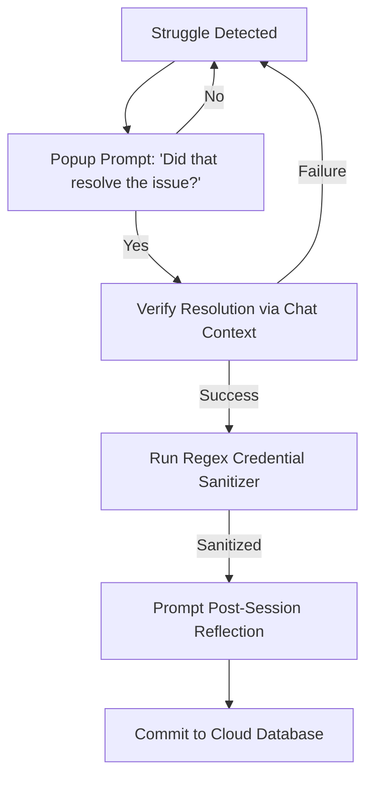

# SkillWeave

**SkillWeave** is an agentic telemetry and collaborative learning companion. It captures the logs, workspace diffs, and developer reflections from team members steering AI agents, indexes them in a shared cloud database (Supabase), and surfaces them as Socratic guideposts when another teammate gets stuck on similar coding, design, or architectural problems.

Unlike standard autocomplete or code search, SkillWeave does **not** copy-paste or spoon-feed solutions. Instead, it exposes peer struggles as **conceptual contrast cases**, helping developers develop independent mental models and steering patterns.

---

## 🔍 Progressive Disclosure UI (IDE Split-Pane / Chat Card)

When the background telemetry watcher detects a match, the system presents suggestions through a seamless transition from chat to workspace views:

### Level 1: Inline Chat Card (Popup above Chat Input)
A styled suggestion card slides in directly above the chat text input area, catching the developer before they submit a prompt:
```
💡 Peer Match Found (94% confidence) — Teammate resolved a similar Firestore permission error.
Pivot Prompt: "How do security rules validate custom token claims compared to standard auth.uid checks?"
[🔍 Open Peer Workspace Pane]  [Dismiss]
```

### Level 2: Workspace Split-Pane (Right-Side Webview)
Clicking the button splits the editor layout, loading a temporary, read-only markdown panel on the right side of the screen (`skillweave://peers/causeway/case-study.md`) displaying comparative deltas and Socratic prompts:
```markdown
[SkillWeave Workspace Pane]
Project: SmartScheduler | Author: User 1
Target Goal: Secure Firestore collections using custom claims.

Peer Reflection:
"We realized that Firestore rule auth.uid does not verify admin custom claims automatically. We resolved this by querying request.auth.token.admin == true. If your team does not use admin roles, evaluate if resource-owner gating fits your collections better."

Comparative Code Diff:
- allow read, write: if request.auth != null && request.auth.uid == userId;
+ allow read, write: if request.auth != null && request.auth.token.admin == true;

Workspace Materials:
- [rules.firestore:L12-25 (Security Rules)](file:///Users/alexisluo/tech4good/design-dir-2/docs-plans/project-foundations/validation-plan.md)
- [admin-claims-schema.json (Database Claims)](file:///Users/alexisluo/tech4good/design-dir-2/docs-plans/project-foundations/product-thesis.md)

Contrast Questions:
1. User 1 gated resources using custom admin claims. Does your collection require administrative hierarchy, or is simple owner-only gating sufficient?
2. What are the security trade-offs of checking custom claims on every query?
```

### Level 3: Collapsible Dialogue Accordion (Inside Split-Pane)
An accordion menu at the bottom of the Workspace Pane that expands to show the peer's actual step-by-step chat conversation history:
```
▶ Click to expand peer dialogue history (8 messages collapsed, 2 Pivot turns shown)
```

---

## 🛰️ Telemetry Collection Hooks

SkillWeave captures telemetry passively in the background of the human-agent conversation across three touchpoints:

1.  **Chat Conversation Watcher:** Monitors active chat dialogues and parses error logs, traceback warnings, or compiler output pasted directly into the chat.
2.  **Workspace Snapshot Listener:** Analyzes workspace context files or code deltas shared by the developer with the agent during the conversation.
3.  **Prompt Sequence Analyzer:** Tracks consecutive user prompts to detect repeat attempts at steering the agent through the same block, triggering a search when a pattern match is found.

---

## 🔒 Verification & Privacy Gates

Before any session is committed to the community database, it must pass three automated background gates:



1.  **Micro-Toast Gate:** When the system detects a resolved struggle (indicated by user statement or positive code compile shared in chat), a popup appears above the chat input:
    `💡 Did that last step resolve the issue? [Yes: Save Log] [No: Keep Working]`
2.  **Validation Check:** Confirms task completion by verifying that updated code structures or test outputs shared in the chat log pass validation rules.
3.  **Credential Sanitizer:** Runs regex parsers over code diffs and chat logs to scrub API tokens, secrets, private URLs, and personal details before saving.

---

## ⚙️ Background Trigger Protocol

SkillWeave triggers directly at the end of a conversational turn, integrating with the reflections skill agent. Rather than scanning raw transcripts on its own, SkillWeave takes the structured reflection outputs generated by the reflections agent.

1.  **Reflections Agent Audit:** The reflections skill agent runs at the end of the turn and outputs a structured reflection (identifying the struggle text and checking if it is an `ERROR-CODE` or `FRUSTRATION`).
2.  **SkillWeave Activation:** If the reflections agent logs an `ERROR-CODE` or `FRUSTRATION`, it invokes the SkillWeave script in `check` mode, passing the struggle type and text directly:
    ```bash
    npx tsx .t4g/skills/skill-weave/scripts/skill-weave-agent.ts \
      --mode check \
      --type "[ERROR-CODE / FRUSTRATION]" \
      --struggle "[STRUGGLE_TEXT]" \
      --workspace-root "<WORKSPACE_ROOT>"
    ```
3.  **Database Query & Matching:** SkillWeave performs a keyword-similarity search directly against the remote Supabase database to locate similar peer case studies.
4.  **Socratic Suggestion Card:** If a match is found (overlap count >= 1), prepend the Level 1 Inline suggestion card above the prompt input window. If the developer clicks `[🔍 Open Peer Workspace Pane]`, open the right-side split-pane view.

---

## 💾 Database Logging Pipeline

When a developer indicates task completion (passing the NLU verification gate), prompt them with post-task reflections and log the entry directly to the central Supabase cloud database:

```bash
npx tsx .t4g/skills/skill-weave/scripts/skill-weave-agent.ts \
  --mode log \
  --workspace-root "<WORKSPACE_ROOT>" \
  --payload '{"type":"TYPE","key":"KEY","insight":"INSIGHT","example":"EXAMPLE","conversation-id":"CONVERSATION_ID"}'
```

*   **type:** Either `ERROR-CODE` or `FRUSTRATION`.
*   **key:** Unique kebab-case name of the learning.
*   **insight:** Description of the struggle (from post-task reflection questions).
*   **example:** The solution that got them unstuck.
*   **conversation-id:** Current conversation UUID.
