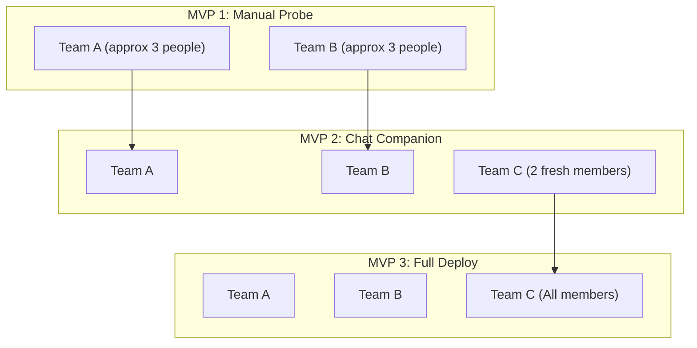

# SkillWeave Validation Plan

<!-- Validation strategy for research-led social innovation projects. Core hypotheses and research questions define what we're trying to learn; the MVP/protostudy sequence defines how we learn it. Owned by /define-validation. Observable signals, interview instruments, and reflection protocols are developed per-MVP using /protostudy-prep. -->

This document provides the strategic overview of what we're validating, why, and in what order. It defines a series of protostudies to validate and derisk both the product and research aspects of the project. Detailed build plans, data collection instruments, and reflection protocols live in per-MVP protostudy documents.

---

## Core Hypotheses & Research Questions

What we're trying to learn, organized by categories that span our integrated approach — contextual understanding, product viability, design knowledge, and community impact. Each item concisely describes what the question/hypothesis is and why it matters to us. They will be fleshed out in more detail in the individual protostudy documents.

### Context: User & Ecosystem

Building a deeper understanding of the user and community ecosystem — surfacing insights about needs and contextual, systemic risks that shape what to design.

1. **H1: Error & Friction Overlap** *(Open Question — MVP 1).* Do different project teams/members working in the same cohort hit overlapping conceptual, design, technical, or steering challenges, or are their friction profiles entirely isolated? *Why it matters:* If different teams have zero overlap in their challenges, a shared community log database will provide zero utility.
2. **H2: Steering Breakdown Signal** *(Open Question — MVP 2).* What interaction signals (e.g. error rate, typing idle time, file reversions) reliably indicate a cohort member has hit a conceptual "breakdown" in agent steering? *Why it matters:* Understanding these signals is necessary to trigger mixed-initiative helper agent offers without annoying the user.

### Value: Product-Market Fit, Demand & Growth

Does the product solve a felt need, and will people adopt and spread it? These questions determine whether the solution is viable as a sustained offering.

3. **H3: Value of Peer Dialogue** *(Prediction — MVP 1).* Cohort members will actively choose to review peer transcripts/highlights to solve roadblocks instead of guessing or asking lab leads. *Why it matters if wrong:* If members prefer asking coordinators directly regardless of peer logs, the tool's adoption will fail.
4. **H4: Scaffolding vs. Direct Answers** *(Prediction — MVP 2).* Cohort members will adopt a constrained diagnostic helper agent that does *not* generate direct answers/code, even though an automated assistant is faster, because they value learning the underlying steering competency. *Why it matters if wrong:* If users reject diagnostic guidance in favor of raw copy-paste answer generation, our educational value proposition collapses.

### Design: Embodiment & Experience

How users interpret and interact with the design — the design conjectures and experiential insights that shape the next design iteration and design theory.

5. **H5: Auxiliary Pane Usability** *(Open Question — MVP 2).* Does rendering the Level 1 Inline Card and Level 2 Workspace Case Studies inside the right-side Artifacts panel (HTML Auxiliary Pane) provide a seamless side-by-side debugging and planning experience, or does it clutter the member's workspace layout? *Why it matters:* Determines whether the system can adapt to standard desktop environments (like Antigravity 2.0) without needing custom Electron sidebar UI overlays.
6. **H6: Summary Preview and 2-Question Reflection** *(Prediction — MVP 3).* Providing a real-time summary preview of the logged data (using `--mode preview` on transcript logs) combined with a simplified 2-question reflection card will increase user trust and reflection quality, while avoiding compliance gaming without triggering task abandonment. *Why it matters:* Balances user transparency against logging friction.

### Impact: Mediating Processes & Outcomes

The deeper psychological and behavioral changes we hope to produce — the theoretical conjectures and the actual community impact we're striving for.

7. **H7: Steering Competency Transfer** *(Prediction — MVP 3).* Using SkillWeave increases cohort members' independence, letting them resolve *new, unseen* agent steering bottlenecks (conceptual, design, or technical) with fewer stuck cycles over time. *Why it matters if wrong:* If builders only learn how to copy specific recipes rather than building general agent-steering mental models, the long-term competence value is lost.
8. **H8: Cohort-Wide Process Adaptation** *(Prediction — MVP 3).* Aggregating individual friction reports allows coordinators to identify common roadblocks across the cohort and optimize team support resources, reducing overall stuck velocity. *Why it matters if wrong:* If coordinators cannot extract actionable cohort insights from the aggregated reports, the community-level value of the telemetry collapses.

---

## MVP / Protostudy Sequence

### Product Perspective

Does a shared registry of AI agent logs actually unblock student teams and improve cohort velocity? The key product risks, in priority order:

1. **Isolated Domains Risk (No Overlap)** — Different teams work on completely different projects, domains, or frameworks, resulting in zero overlapping bottlenecks and no reason to query the database.
2. **Scaffolding Abandonment Friction** — Members find the helper agent's Socratic prompts too slow and annoying, preferring to copy-paste direct answers/code from general AI assistants.
3. **Log Graveyard Risk** — Cohort members ignore the dashboard and peer registry entirely, relying on direct coordinator help.

### Research Perspective

Does constraining assistant outputs and aggregating transcripts successfully drive individual metacognition and organizational process learning? The key research risks, in the order we need to verify them:

1. **Cognitive Offloading Predominance** — Planners and designers prioritize execution speed over learning, writing low-effort gibberish reflections to bypass triggers.
2. **Context Loss in Synthesis** — The LLM-generated Socratic Pivot Highlights fail to capture the necessary tacit context, forcing members to read raw logs (nullifying streamlining).
3. **Dashboard Insignificance** — Lab coordinators do not utilize the aggregated telemetry because the compiled summaries fail to expose actionable common roadblocks.

### Summer Cohort Study Allocation Plan (~10 People, 3 Teams)

For small cohort environments (e.g., a summer research cohort consisting of ~10 members across 3 teams: Team A, Team B, and Team C), participants are rationed progressively to preserve an unbiased "novice" comparison group for learning transfer evaluation:

*Note: If your Markdown previewer does not render the visual Mermaid diagram below, reference this text-art flowchart:*

```text
┌──────────────────────────────────────────────┐
│             MVP 1 (Manual Probe)             │
│  [Team A (approx 3)]  │  [Team B (approx 3)] │
│  (Test: Overlap)      │  (Test: Overlap)     │
└──────────┬────────────┴──────────┬───────────┘
           │                       │
           ▼                       ▼
┌──────────────────────────────────────────────┐
│           MVP 2 (Chat Companion)             │
│  [Team C (2 fresh)]   │  [Team A] │ [Team B] │
│  (Test: Constraints)  │  (Test: UI Usability)│
└──────────┬────────────┴──────────┬───────────┘
           │                       │
           ▼                       ▼
┌──────────────────────────────────────────────┐
│             MVP 3 (Full Deploy)              │
│  [Team C (All)]       │  [Team A] │ [Team B] │
│  (Test: Transfer)     │  (Test: Long-term)   │
└──────────────────────────────────────────────┘
```



*   **MVP 1 (Manual Probe):** Deployed only to **Team A and Team B** (~6 people). Team C is held back as a clean control group. We audit the manual logs to verify roadblock overlap across different project teams.
*   **MVP 2 (Streamlined Chat Companion):** Deployed to **Team A and Team B** (the 6 veterans, to get comparative usability feedback) plus **2 fresh members of Team C** (to observe how a first-time user reacts to the interface constraints).
*   **MVP 3 (Full Deploy):** Deployed to **all 3 teams** (entire 10-person cohort). Team C's remaining members act as the clean baseline group to measure steering competency transfer.

### Timeline

We will deploy our validation sequence across the project teams in our research lab. We start with a no-code manual probe to test the overlap hypothesis, scale to a low-code chat companion prototype to test scaffolding interfaces, and finally deploy the integrated system to study learning outcomes.

| Phase | Target Date | What Happens | What We Learn |
|---|---|---|---|
| MVP 1: Manual Sharing Probe | [Date] | Deploy a shared Google Drive/GitHub folder where 3 teams manually copy-paste resolved bottlenecks and 2-sentence prompt fixes. | H1 (Error/friction overlap) and H3 (Value of peer logs). |
| MVP 2: Streamlined Chat Companion | [Date] | Deploy in-chat companion rules and background checking modes, rendering cards as system markdown files (`peer_suggestion_card.md`) in the right-side Artifacts panel for 10 cohort members. | H2 (Breakdown signals), H4 (Scaffolding adoption), and H5 (Auxiliary pane usability). |
| MVP 3: Full SkillWeave Deploy | [Date] | Deploy full integration (persistent confirmation cards inside the chat panel, automated transcript-preview scanner, 2-question reflection prompts, real-time seeder writes, and cohort knowledge sharing) across the entire lab cohort. | H6 (Summary preview engagement), H7 (Competency transfer), and H8 (Cohort process adaptation). |

### MVP 1: Manual Sharing Probe (No-Code)

**Purpose:** De-risk the foundational assumption that teams hit overlapping errors and will actively read peer logs before building any automated infrastructure. *(Addresses: H1 [Error & Friction Overlap], H3 [Value of Peer Dialogue])*

**What we build:**
Zero custom code. We create:
- A shared Google Drive folder or a designated repo directory.
- A basic, 1-page template where members copy-paste: (1) their raw error or roadblock log, (2) their successful prompt adjustment, and (3) a 2-sentence reflection on what they learned.
- We mandate that when members get stuck, they must check this shared directory first.

**How we learn:**
We deploy this for 2 weeks across 3 active lab teams. We collect:
- Access logs / document view history of the shared folder.
- Self-reports: did they find a peer log? Did it help them resolve their issue?
- Researcher audit: we analyze their resolved issues to calculate the percentage of technical and conceptual overlap between different teams.

→ Detailed plan: *to be created via /protostudy-prep*

### MVP 2: Streamlined Chat Companion (Low-Code)

**Purpose:** Validate whether users will accept a constrained diagnostic agent (no direct answer generation) and if the right-side Auxiliary Pane provides a seamless split-view experience. *(Addresses: H2 [Steering Breakdown Signal], H4 [Scaffolding vs. Direct Answers], H5 [Auxiliary Pane Usability])*

**What we build:**
A lightweight in-chat companion prototype:
- A background execution harness (`skill-weave-agent.ts`) invoked by chat hooks to run checking (`--mode check`), database pulls (`--mode pull`), and diagnostics status.
- Integration rules that write Level 1 Inline Cards (`peer_suggestion_card.md`) to the active conversation directory, prompting Antigravity 2.0 to open and render them in the right-side Artifacts panel.
- Inside the card, clicking `[🔍 Open Peer Workspace Pane]` redirects the panel to render the peer's Socratic questions and file/prompt diffs side-by-side with the chat.
- Telemetry logging: we log typing speed, idle time, and error/friction frequencies to map breakdown signals.

**How we learn:**
Deploy to 10 cohort members. We track:
- Invocations: how often do they click the redirect link in the suggestion card?
- Navigation: how often do they reference the auxiliary pane during troubleshooting?
- Exit Interviews: we interview members about the cognitive friction of being guided instead of given direct answers, and whether the side-by-side markdown panels felt natural.

→ Detailed plan: *to be created via /protostudy-prep*

### MVP 3: Full SkillWeave Deploy (Integrated System)

**Purpose:** Evaluate learning outcomes (reflection quality under preview transparency and competency transfer) and cohort-wide process adaptation. *(Addresses: H6 [Summary Preview and 2-Question Reflection], H7 [Steering Competency Transfer], H8 [Cohort-Wide Process Adaptation])*

**What we build:**
The complete integrated system:
- Persistent confirmation cards in the chat pane that wait for a user's "Resolved" click.
- Real-time preview generation which scans the conversation transcript logs from bottom to top to identify the recent struggle and modified files.
- Simplified 2-question reflection toast inside the chat interface.
- Logging modes (`--mode log` invoked in the background) that update the local SQLite database and perform real-time write-backs to `peer-struggles.json`.
- Git-based push/pull syncing and a shared cohort-wide knowledge dashboard to display friction patterns.

**How we learn:**
Deploy across the entire lab cohort (20+ members) during a 6-week sprint. We collect:
- Reflection logs to evaluate prompt quality scores over time.
- Transfer tests: we evaluate members on new, unseen agent steering tasks (conceptual planning or technical coding) to measure stuck-cycles and resolution time.
- Coordinator interviews: we track how coordinators use the dashboard to identify common roadblocks and adapt support resources.

→ Detailed plan: *to be created via /protostudy-prep*

---

## Positionality Statement

<!-- What biases and assumptions are you bringing to this project? How does your background (gender, race, SES, personal history) affect how you view the users and the problem? How might users perceive your authority? -->

The primary researcher is a student peer and researcher within the same academic lab cohort as the study participants. The researcher has no institutional authority, grading control, or onboarding oversight over the participants, which minimizes compliance bias. However, because the study includes participants from different project teams who may have joined the lab at different times and do not know the researcher well, some social distance or apprehension may exist during data collection. 

The researcher's motivation is rooted in personal frustrations with generative AI assistants failing to understand prompt steering instructions, leading to a personal belief that referencing peer examples is highly valuable for troubleshooting. This background introduces a design bias favoring Socratic scaffolding and community transcript sharing. To mitigate these biases and social dynamics, the tool enforces decentralized, local-first storage, logs are anonymized before cohort sharing, and exit interviews will utilize non-judgmental, open-ended questions.

---

## Appendix: Stances & Deferred Issues

<!-- Stances & Open Issues from the validation process. Owned by /define-validation.
     Log ONLY:
     - 🔵 Strong Stances: moments where the user pushed back against something the agent proposed and explained their reasoning. Must state what was rejected and why.
     - ⏳ Deferred Issues: hypotheses to revisit, research questions deferred to later MVPs, or unresolved tensions.
     Do NOT log decisions that have been fully incorporated into the main body. -->

### Core Hypotheses & Research Questions
- 🔵 **Preference for Simple Wording:** The agent proposed rewriting predictions into strict "If/Then/Because" template formats to ensure testability. The user rejected this, preferring the current high-level wording to keep the document concise and readable.

### MVP / Protostudy Sequence
