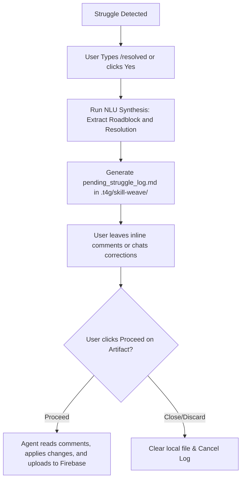

# SkillWeave

**SkillWeave** is an agentic telemetry and collaborative learning companion. It captures the logs, workspace diffs, and reflections from team members steering AI agents, indexes them in a shared cloud database (Firebase Firestore), and surfaces them as Socratic guideposts when another teammate gets stuck on similar planning, design, or technical problems.

Unlike standard autocomplete or code search, SkillWeave does **not** copy-paste or spoon-feed solutions. Instead, it exposes peer struggles as **conceptual contrast cases**, helping cohort members develop independent mental models and steering patterns.

---

## 🔍 Conversational Suggestion & Deep-Dive Flow (Antigravity 2.0)

When the background telemetry watcher detects a match, the system presents suggestions through a low-friction conversational disclosure:

### Level 1: Inline Chat Socratic Suggestion
The assistant prints the peer's roadblock and Socratic pivot questions directly as text inside the active chat window, keeping the workspace clean:
```
💡 Peer Match Found (94% confidence) — Teammate resolved a similar Firestore permission error.
Pivot Questions:
1. Does your active task focus strictly on programming, or does it involve high-level planning, design, or conceptual writing?
2. What are the security trade-offs of checking custom claims on every query?

Would you like to see their code diffs/detailed case study? (Type "yes" or click the button below)
[🔍 Open Peer Workspace Pane]
```

### Level 2: Detailed Workspace Pane (Right-Side Read-Only Artifact)
If the user clicks `[🔍 Open Peer Workspace Pane]` or types "yes" in the chat, the agent creates a temporary, read-only Artifact file (`.t4g/skill-weave/peer_workspace_case_study.md`) which automatically loads in the right-side Artifacts panel. This displays comparative deltas and Socratic prompts:

# [SkillWeave Workspace Pane]
-------------------------------------------------------------

## 📝 Peer Roadblock & Summary
**Summary**: Faced a mismatch between auth.uid check logic and custom admin claims, and resolved this by checking request.auth.token.admin == true instead of standard uid matches.

**Roadblock**: The cohort member realized that Firestore rule auth.uid does not verify admin custom claims automatically.

**Resolution**: They resolved this by querying request.auth.token.admin == true. If your team does not use admin roles, evaluate if resource-owner gating fits your collections better.

---

## 🔍 Comparative Code Diff
```diff
- allow read, write: if request.auth != null && request.auth.uid == userId;
+ allow read, write: if request.auth != null && request.auth.token.admin == true;
```

---

## 🎙️ Verbatim Dialogue History
**User**: Why does the security rule auth.uid fail for my admin role checks?

> **Agent**: The auth.uid check only checks the uid string match. Custom claims are nested inside request.auth.token.

**User**: Oh I see, I should check token.admin instead.

### Level 3: Helpfulness Feedback (Native Multiple-Choice Question)
Once the struggle is resolved, the assistant triggers the native IDE **Multiple-Choice Question (`ask_question`)** widget in the chat:
```
How helpful was the peer's log in unblocking you?
[5 - Extremely Helpful] [4] [3] [2] [1 - Not Helpful] [Skip]
```

---

## 🛰️ Hybrid Telemetry & Explicit Triggers

SkillWeave captures telemetry passively and supports explicit declarations to balance automation against trigger errors:

1.  **Direct User Declaration (Primary)**:
    *   The user types `/stuck` in the chat to explicitly flag a struggle.
    *   The user types `/resolved` in the chat to explicitly flag that they have solved the issue and are ready to review the reflection card.
2.  **Telemetry Gating (Secondary)**: Monitors active chat dialogues and parses consecutive compiler outputs or prompt reversions. If a pattern matches, the agent prompts: *"I notice some friction. Type `/stuck` if you'd like to document this roadblock."*
3.  **Context-Shift Watcher**: Monitors the conversational dialogue for NLU topic shifts (e.g. switching from database configs to study questions) to prompt the user for resolution check.

---

## 🔒 Verification, Synthesis & Collaborative Review Gates

Before any case study is committed to the database, it passes through an NLU synthesis and collaborative review loop:



1. **Resolution Check Gating**: Once a struggle resolution is declared, the agent writes a small, temporary artifact `resolve_query.md` rendered on the right side:
   > *"I notice a struggle. Have you resolved it? Click **Proceed** to review and log, or close this card to ignore."*
2. **NLU Synthesis**: Clicking **Proceed** triggers the agent to synthesize the conversation transcript and write it to `.t4g/skill-weave/pending_struggle_log.md` (which is added to `.gitignore`). The review card must follow these strict formatting guidelines:
   *   **Brief Non-Technical Summary**: The summary field must be a short, jargon-free paragraph describing the challenge and resolution in general terms, ending with exactly one Socratic question on a new line.
   *   **Clean Dialogue History**: Must consist strictly of alternating User (`**User**:`) and Agent (`> **Agent**:`) turns, with formatting (newlines/indentation) preserved. All system messages, tool execution logs, compiler logs, and command outputs must be excluded so the review card content matches the Firestore upload payload exactly.
   *   **Descriptive Slugs**: The struggle key must be formatted as `author-description` slugified from the first 4-5 keywords of the roadblock, avoiding random timestamps.
3. **Collaborative Comment Gating**: On Antigravity 2.0, the artifact is read-only. The user leaves inline comments directly on the artifact (or chats corrections to the agent), and then clicks **Proceed**. The agent reads the comments, updates the file contents, and commits the finalized log to Firebase Firestore.

---

## 💾 Offline Chat History Saving & Firestore Chat Syncing

To maintain user privacy while enabling rich peer learning, conversation history is managed through a hybrid offline-to-cloud lifecycle:

### 1. Privacy-First Local Tracking
All conversational turns and telemetry watches operate strictly **offline/locally** inside the user's local Antigravity session storage. No raw chat logs are streamed or uploaded to the cloud during active development.

### 2. Transcript Extraction (`/save-chat-transcript`)
When the user types `/resolved`, the agent triggers the `/save-chat-transcript` skill to read the local session transcript, filter out noise (such as status updates or compiler outputs), and isolate the dialogue turns relevant to the struggle.

### 3. Dual-Collection Firestore Sync
When the user approves the review card by clicking **Proceed**, the agent commits the verified struggle across two synchronized Firestore collections:

1. **`struggles/{key}` Collection**:
   * `key`: Formatted struggle slug (`author-description`).
   * `author`: Lowercase user account name (detected cross-platform via OS username / environment).
   * `summary`: The plain-English summary paragraph and concluding Socratic question.
   * `roadblock`: The core obstacle encountered.
   * `resolution`: How the roadblock was overcome.
   * `dialogue_history`: Verbatim alternating user/agent conversation turns.
   * `conversation_id`: Unique ID linking to the parent chat document.
   * `phase_index`: 0-based index of the struggle phase within the chat document.
   * `start_message_index` & `end_message_index`: Exact boundary indices of the struggle exchange.

2. **`chats/{conversation_id}` Collection**:
   * `user`: Lowercase account username (**guaranteed equal to `author` in `struggles`**).
   * `project`: Dynamic project repository name.
   * `topic`: High-level domain area (e.g. `product`, `research`, `engineering`).
   * `phases`: Array of phase objects containing `title` (`Struggle: <key>`) and `messages` (array of `{ sender, content }`).
   * `evolution`: Array of milestone snapshots (preserved across syncs).

---

## ⚙️ Background Script Command Reference

All background commands execute the globally registered script (`~/.gemini/config/plugins/...`), enabling full functionality across any workspace repository:

### 1. Match Check Command
Checks recent transcript or explicit inputs for matching cohort struggles:
```bash
npx tsx ~/.gemini/config/plugins/agent-learning/skills/skillweave/scripts/skill-weave-agent.ts \
  --mode check \
  --type "[ERROR-CODE / FRUSTRATION]" \
  --struggle "[STRUGGLE_TEXT]" \
  --workspace-root "<WORKSPACE_ROOT>"
```

### 2. Detailed Peer Case Study View
Generates `peer_workspace_case_study.md` inside `.t4g/skill-weave/` for a specific matched case:
```bash
npx tsx ~/.gemini/config/plugins/agent-learning/skills/skillweave/scripts/skill-weave-agent.ts \
  --mode view-peer \
  --id "[PEER_CASE_ID]" \
  --workspace-root "<WORKSPACE_ROOT>"
```

### 3. Draft Review Card Command
Generates `pending_struggle_log.md` inside `.t4g/skill-weave/` for a resolved struggle:
```bash
npx tsx ~/.gemini/config/plugins/agent-learning/skills/skillweave/scripts/skill-weave-agent.ts \
  --mode draft-log \
  --transcript "[TRANSCRIPT_PATH]" \
  --id "[CONVERSATION_ID]" \
  --workspace-root "<WORKSPACE_ROOT>"
```

### 4. Database Committing Command
Parses the user-reviewed file, applies corrections, and uploads the finalized struggle and chat phase:
```bash
npx tsx ~/.gemini/config/plugins/agent-learning/skills/skillweave/scripts/skill-weave-agent.ts \
  --mode log \
  --file ".t4g/skill-weave/pending_struggle_log.md" \
  --workspace-root "<WORKSPACE_ROOT>"
```
